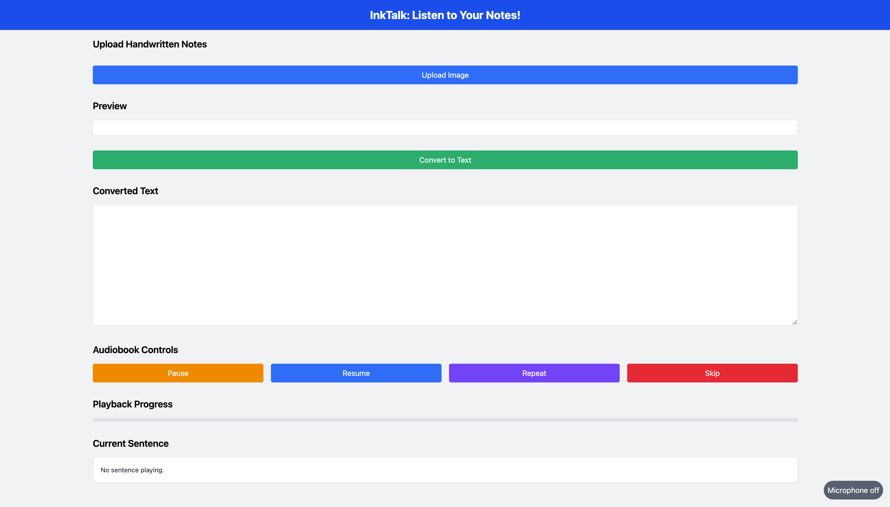
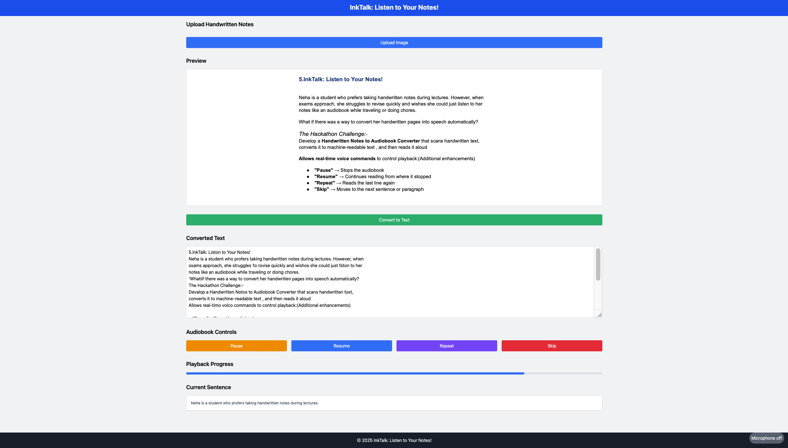

# InkTalk: Listen to Your Notes!

**InkTalk** is a web-based application designed to help students like Neha convert their handwritten notes into audiobooks. With InkTalk, users can scan their handwritten pages, convert the text into machine-readable format using Optical Character Recognition (OCR), and listen to their notes as an audiobook. The app also supports real-time voice commands for playback control, making it a convenient tool for quick revisions while on the go.





## Features

-  **Handwritten Notes to Audiobook**: Convert handwritten notes into spoken words using OCR technology.
-  **Real-Time Voice Commands**: Control playback with simple voice commands:
   -  **"Pause"**: Stops the audiobook.
   -  **"Resume"**: Continues reading from where it stopped.
   -  **"Repeat"**: Reads the last line again.
   -  **"Skip"**: Moves to the next sentence or paragraph.
-  **User-Friendly Interface**: Built with **HTML**, **Tailwind CSS**, and **JavaScript** for a clean and responsive design.
-  **Cross-Platform**: Works on any modern web browser.

## How It Works

1. **Upload Handwritten Notes**: Users upload an image of their handwritten notes.
2. **OCR Processing**: The app uses OCR to extract text from the image.
3. **Text-to-Speech (TTS)**: The extracted text is converted into speech using a TTS engine.
4. **Voice Commands**: Users can control playback using voice commands for a hands-free experience.

## Technologies Used

-  **Frontend**: HTML, Tailwind CSS, JavaScript
-  **OCR**: [Tesseract.js](https://tesseract.projectnaptha.com/) (JavaScript library for OCR)
-  **Text-to-Speech**: [Web Speech API](https://developer.mozilla.org/en-US/docs/Web/API/Web_Speech_API)
-  **Voice Commands**: [annyang](https://github.com/TalAter/annyang) (JavaScript library for voice commands)

## Installation

To run InkTalk locally, follow these steps:

1. **Clone the Repository**:

   ```bash
   git clone https://github.com/your-username/inktalk.git
   cd inktalk
   ```

2. **Install Dependencies**:
   No additional dependencies are required for the frontend. Simply open the `index.html` file in your browser.

3. **Run the Application**:
   Open `index.html` in your preferred web browser.

## Usage

1. **Upload an Image**:
   Click the "Upload Image" button to select a scanned image of your handwritten notes.

2. **Convert to Audiobook**:
   The app will process the image using OCR and display the extracted text.
   Click "Play" to start listening to your notes.

3. **Use Voice Commands**:
   Say "Pause", "Resume", "Repeat", or "Skip" to control playback.

## Future Enhancements

-  **Multi-Language Support**: Add support for handwritten notes in multiple languages.
-  **Cloud Integration**: Allow users to save and access their notes from the cloud.
-  **Mobile App**: Develop a mobile version for easier access on smartphones.
-  **Advanced Editing**: Enable users to edit the extracted text before converting it to speech.

## Contributing

We welcome contributions! If you'd like to contribute to InkTalk, please follow these steps:

1. Fork the repository.
2. Create a new branch for your feature or bug fix.
3. Commit your changes.
4. Submit a pull request.

For more details, refer to the Contribution Guidelines.

## License

This project is licensed under the MIT License. Feel free to use, modify, and distribute it as needed.

## Acknowledgments

-  **Tesseract.js** for OCR functionality.
-  **Web Speech API** for text-to-speech.
-  **annyang** for voice command integration.
